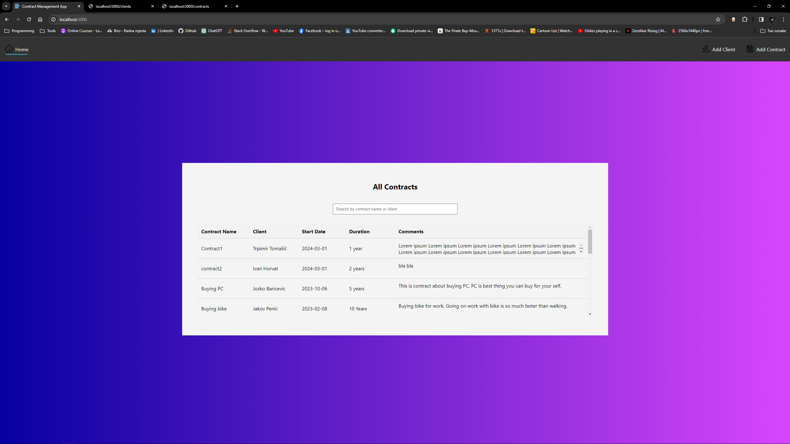

# React App with JSON Server

This project demonstrates a simple React application integrated with a JSON server to manage clients and contracts.

## Getting Started

To run this project locally, follow these steps:

1. Install dependencies:
   npm install
   
2. Start the JSON server for managing clients and contracts:
  json-server --watch data/db.json --port 5000

3. In a separate terminal, start the React app:
  npm start

4. Open http://localhost:3000 in your web browser to view the app.

Endpoints
Clients: http://localhost:5000/clients
Contracts: http://localhost:5000/contracts
